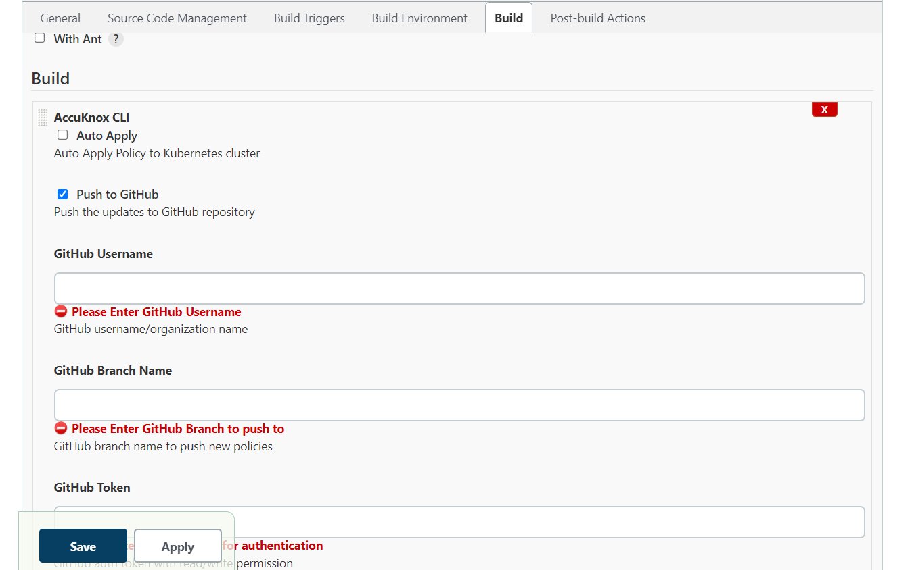

# Jenkins Plugin: AccuKnox Policy Tool

Allows you to apply or push AccuKnox Auto-discovered and Policy-Template policies to the Kubernetes cluster or GitHub repository of your choosing.

```
// Example when used in a pipeline
node {
  stage('AccuKnox Policy push to GitHub') {
    steps {           
      KnoxAutoPol(useAutoApply: false, pushToGit: true, gitBaseBranchName: deploy-demo ,gitBranchName: demobranch, gitToken: gh_demotoken, gitRepoUrl: https://github.com/demouser/demorepo.git, gitUserName: demouser )
    }
  }
}
```

## Prerequisites

-   A Jenkins installation running version 2.164.1or higher (with jdk8 or jdk11).
-   A node with Kubectl configured    
-   A Kubernetes cluster. [ Optional ]    
-   A GitHub token with read/write permission    
-   A GitHub repository to update the policies
    

## How it works

Once the build starts, the plugin generates a set of AccuKnox policies [ consisting of KubeArmor and Cilium Policies ]. The policy files are stored in `/tmp/accuknox-client-repo/<repo-name>` and will be deleted once the GitHub push is completed. The plugin also creates temporary files under `$USER/$CURRENT_DIR`.

The plugin makes use of 3 modules

1.  **Auto-Discover:** This module helps the auto-discovery of AccuKnox policies based on the workloads that are present in the current Kubernetes cluster. This module makes use of auto-discovery scripts outline in  [AccuKnox help section](https://help.accuknox.com/).
    
    1.  [Install Daemonsets and Services](https://help.accuknox.com/open-source/quick_start_guide/#2-install-daemonsets-and-services)
        
    2.  [Get Auto Discovered Policies](https://help.accuknox.com/open-source/quick_start_guide/#4-get-auto-discovered-policies)
        
    
    The output is stored into a new folder ad-policy under the current working directory and is transferred to the GitHub repo under `/tmp/accuknox-client-repo/<repo_name>`
    
2.  **Policy-Templates:** This module is responsible for downloading the latest updates from the [policy-template](https://github.com/kubearmor/policy-templates) repository and shortlisting policies that are relevant to the workloads that are present in the current Kubernetes cluster. This module also automatically replaces the name, namespace, and label field with that of the current Kubernetes cluster so that the policies are enforceable.
    
3.  **Git-Operations:** The git operation module ensures that the updated policies are pushed to a new branch and creates and merges a PR to the CD-enabled branch of the users choosing.
    

## Quick Usage Guide

### Parameters

| | Name | Mandatory | Description |
|--|--|--|--|
| 1 | `gitBaseBranchName` | yes | The GitHub base branch name to which PR needs to be created and merged |
| 2 | `gitBranchName` | yes | The GitHub branch name to which new updates are to be pushed |
| 3| `gitToken` | yes | GitHub token with read/write permission |
| 4 | `gitRepoUrl` | yes | GitHub base repository URL for cloning and updating the values. eg: https://github.com/owner_info/repo_name.git |
| 5 | `gitUserName` | yes | GitHub username/organization name to which the repository belongs. |
| 6 | `useAutoApply` | no | Boolean flag. Turn on to apply the generated policies to the cluster directly. |
| 7 | `pushToGit` | yes | Boolean flag. Checking this flag is required if the policies need to be updated to the GitHub repository |

### Using the Plugin in a Pipeline

The AccuKnox-CLI plugin provides the function KnoxAutoPol() for Jenkins Pipeline support. You can go to the _Snippet Generator_ page under the _Pipeline Syntax_ section in Jenkins, select _KnoxAutoPol: Setup AccuKnox CLI_ from the _Sample Step_ dropdown, and it will provide you configuration interface for the plugin. After filling the entries and clicking _Generate Pipeline Script_ button, you will get the sample scripts that can be used in your Pipeline definition.

Example:

```
node {
  stage('AccuKnox Policy push to GitHub') {
    steps {           
      KnoxAutoPol(useAutoApply: false, 
          pushToGit: true, 
          gitBaseBranchName: deploy-demo, 
          gitBranchName: demobranch, 
          gitToken: gh_demotoken, 
          gitRepoUrl: https://github.com/demouser/demorepo.git, 
          gitUserName: demouser )
    }
  }
}
```

### Using the Plugin from the Web Interface

1.  Within the Jenkins dashboard, select a Job and then select "Configure"    
2.  Scroll down to the "Build" section    
3.  Select "AccuKnox CLI"    
4.  In the checkbox, select which is applicable (eg. Push to GitHub )    
5.  Open the Advanced tab    
6.  Fill in the necessary details like GitHub username, token, etc    
7.  Save
    
](./images/build-section.png) 

](./images/plugin-parameters.png) 

## Development

### Building and testing

Clone the GitHub repository

```
git clone git@github.com:accuknox/jenkins-integration.git
```

Change directory to jenkins-integration

```
cd jenkins-integration
```

To build the extension, run:

```
mvn clean package
```

and upload target/knoxautopol.hpi to your Jenkins installation.

To run the tests:

```
mvn clean test
```

### Performing a Release

```
mvn release:prepare release:perform
```